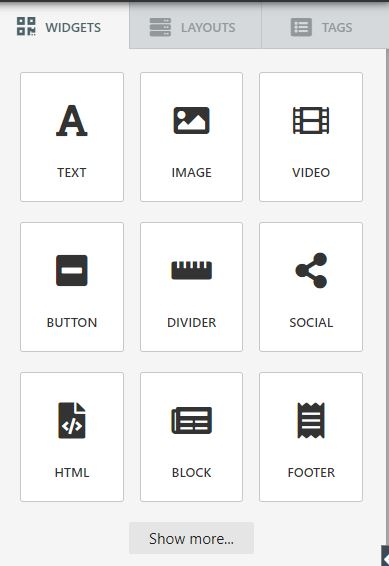

<!-- TODO: Update with your values. -->
# Done4U Email Marketing Web Application
> Personalized Email Marketing Web Application

## Introduction

It is high time you upgrade your Email Marketing strategy. Come and discover the full potential of an all-in-one email marketing automation platform. Start sending Personalized Emails with our new Email Marketing Web Application. It is a feature-rich and easy to use Web Application written in PHP / Laravel 5 that lets you send high-volume marketing emails via our server. There are several things that make our product quite different from other free email marketing services. The basic flow is that a customer can register, login, add contact, add a template and send emails to market their own products.

##  What makes us unique?

We provide Email Marketing Web Application with no added baggage to weigh you down. The software provides you with almost everything that you need with a handful of very cool and helpful features.

##### Pay as you use
Rather than purchasing software to install, or additional hardware to support it, customers subscribe to our SaaS offering. Generally, they pay for this service on a monthly basis using a pay-as-you-go model. Transitioning costs to a recurring operating expense allows our clients to exercise better and more predictable budgeting.
##### Scalability
Done4U Marketing offers high vertical scalability, which gives customers the option to access more, or fewer, services or features on-demand.
##### Flexible, Smart Segmentation
Create segments based on profile data, campaign engagement and customer interests. Send targeted campaigns based on specific offers, attractive plans, or overall customer involvement. Target and reactivate inactive users and customers from time to time so that you can perfectly communicate with your positive leads.
##### Automation for Personalization
Build automation workflows tailored to your customer’s interest journey thus nurturing your relationship with your customers. Ability to work swiftly with customizable pre-built templates is the most attractive feature of our software.
##### Automatic updates 
As we intend to provide the best software in the market, we believe in updating our product from time to time. Rather than purchasing the all new software, our clients can get automatically upgraded with the additional features and patch management. This reduces the burden on in-house IT staff who can attend to other in-house projects.
##### Accessibility and persistence
Since SaaS applications are delivered over the Internet, users can access them from any Internet-enabled device and location.

## What do we provide?

We provide Email Marketing Web Application with no added baggage to weigh you down. The software provides you with almost everything that you need with a handful of very cool and helpful features.

##### Email Marketing Lists
A detailed Email marketing list can be used to target an audience on different social media platforms, thus enabling you to reach more and more people who might not open the emails that you have sent.

##### Schedule your Emails
Scheduling emails in advance can help save time and make your job easier. Scheduled emails are sent just at the time scheduled for, and we guarantee that the emails will be sent on time. In business, there are countless tasks that need to be completed every single day. You can also build a library of email templates to reuse in the future.

##### Process of Content Management is super simple
Getting ready for the apt business email template, from scratch, is as simple as never before. Get amazed by the best designs in the industry. Build a beautiful campaign from a template, or from scratch in seconds.

##### Live upgrade support
Done4U comes with the Upgrade Manager dashboard which allows you to easily do a live version upgrade feature.

##### Multiple Layout and Template Selections
Numerous layouts and templates for your email body are provided with a very simple drag-and-drop editor to build and send personalized emails in minutes. In just a few clicks, your job is done.

##### Suitable for any kind of businesses
No matter what business your deals with, we present features you need to understand your audience and reach them when it matters the most.

##### Easy to build campaign 
Numerous pre-built templates and layouts and ready-made segments are at your fingertips. With design tools, it is easy to create creative campaigns reaching out to all your probable customers.

## Salient Features

The Dashboard actually looks like the figure given below:

<kbd></kbd>

Our Dashboard Header Links looks like the shot as given below:

<kbd></kbd>

The following links are present in the header:
* Dashboard
* Campaigns
* Automation
* Lists
* Templates
* Sending
* Activity log(with an icon)

#### Campaigns

<kbd></kbd>

#### Lists

<kbd></kbd>

#### Templates
Marketing Emails can be designed from the built in templates. It is a very simple procedure since we use the drag and drop feature. From the right pane we can simply drag-in the items that we want on the page.
* **Selecting a Layout**

<kbd></kbd>

* **Start Designing**

<kbd></kbd>

* **Add Widget/Layout Options**

<kbd></kbd>

<kbd></kbd>

<kbd></kbd>

## To Summarize

Done4U Email Marketing Web Application brings innumerable facilities for an easy marketing strategy to reach out to the huge mass of probable and existing customers, by maintaining a time to time marketing emailing technique. Done4U brings to you: 

* Pay only for whatever features you desire to use
* High vertical scalability giving customers the option to opt for more, or fewer, services or features on-demand.
* Get automatic software updates
* Ability to access from any location and any device of your choice
* Create segments based on profile data, campaign engagement and customer interests
* Simple and easy to understand basic flow of the application
* **Create Contact List, Create Marketing Campaign, Create Email Template, Add Shortcodes, Send Email** and also  **Track Email**.
* Create Email Marketing List enabling you to reach more and more people
* Ability to track people who might not even open your emails
* Schedule your emails for any time of the day
* Multiple Layouts and templates are provided to design your email body with easy
* Any business type can utilize the application
* A customer just needs to register and create their login to be able to use the features

#### **Get started with Done4U’s email marketing tool. Create professional looking content. Make life simple. Save time. Market your products beyond expectation.**